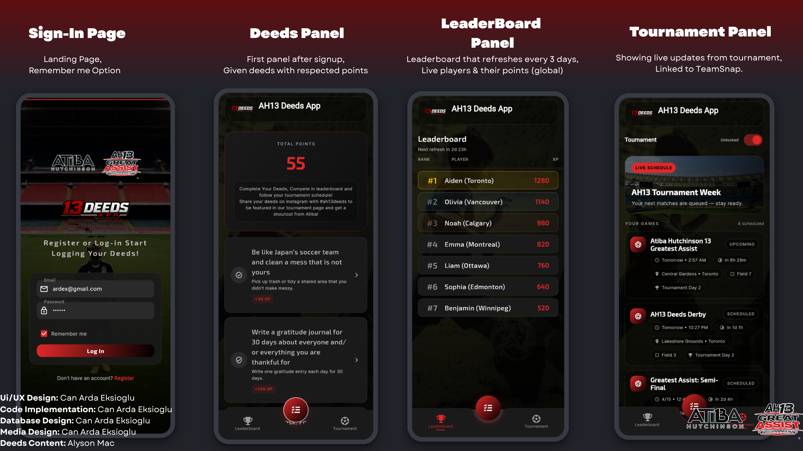

# Ah13App


A mobile application built with **DreamFlow Agent** - an AI-powered agent framework for creating intelligent mobile applications.

## Overview

Ah13App is a cross-platform mobile application designed to run on both iOS and Android devices, leveraging the power of DreamFlow Agent for intelligent automation and decision-making.

## Supported Platforms

- **iOS** (XSS-compatible)
- **Android**

## ⚠️ Important: API Keys Revoked

This repository was made public, and consequently, **all API keys have been revoked** for security purposes. 

To make the app fully functional, you will need to:

1. Generate new API keys from the respective services
2. Update the configuration files with your new credentials
3. Ensure proper environment variable setup (see Running the App section)

**Do not commit API keys directly to the repository.** Use environment variables or a secure secrets management system instead.

## Running the App

### Prerequisites

- Node.js / npm (or the relevant package manager for your setup)
- iOS development tools (Xcode for iOS builds)
- Android development tools (Android Studio for Android builds)
- DreamFlow Agent dependencies

### iOS

```bash
# Install dependencies
npm install

# Update API keys in configuration
# Edit .env or config files with your new API keys

# Run on iOS
npm run ios
# or
npx react-native run-ios
